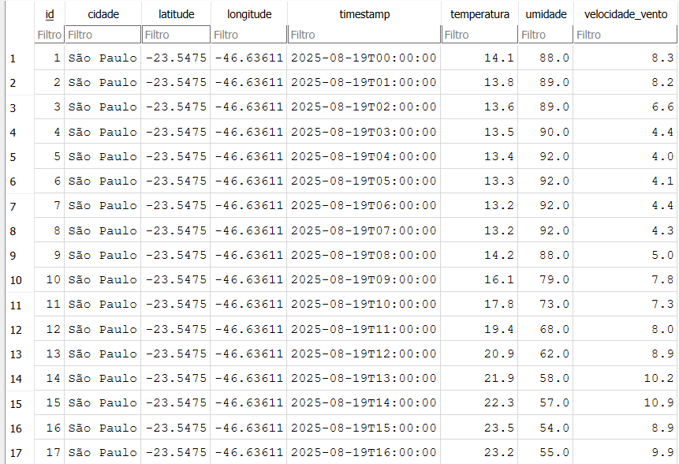
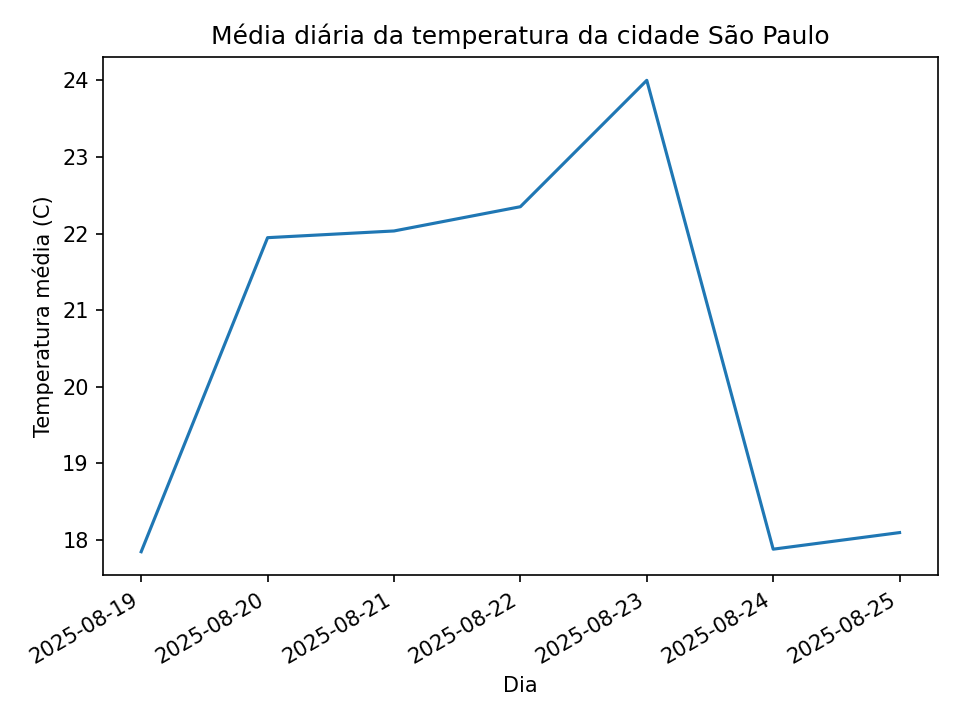
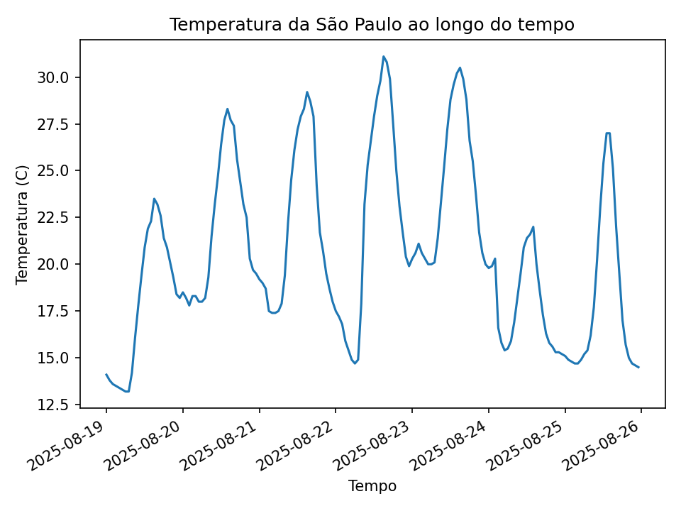

# Pipeline de dados climáticos utilizando a API Open Meteo
## Projeto em construção


### Conceito do projeto
Implementação de uma pipeline idempotente em Python que consome uma API pública ([Open Meteo](https://open-meteo.com/)). Além disso os dados são persistidos em um banco de dados SQLite, o qual possui uma chave composta, evitando duplicidades. Por fim, o projeto também gera gráficos de análise via CLI.

### Objetivos do projeto
1. **Consumir uma API pública** sem a necessidade de uma chave de acesso.
2. **Persistir dados** em um banco SQLite com **idempotência**, ou seja os dados não são duplicados.
3. **Gerar gráficos** de séries temporais e médias diárias.
4. **Organizar o código em camadas** com o objetivo de facilicar a manutenção.


### Pipeline do projeto
1) Os dados são consumidos da API pública Open Meteo 
2) Os dados são persistidos em séries horárias no SQLite
3) São gerados gráficos de temperatura referentes as cidades


## Estrutura do código
```
api-consumption-python-weather/
│── data/                 # arquivo banco de dados gerado
│── examples/             # imagens de exemplo do README
│── reports/              # gráficos gerados
│── src/                  # diretorio com o código
│   ├── api_client.py     # cliente da api
│   ├── database.py       # arquivo referente as operações do banco
│   ├── analysis.py       # arquivo que plota os gráficos
│   └── main.py           # script principal
│── tests/                # diretorio de testes
│── requirements.txt
│── README.md
│── .gitignore
```


## Stack
* Python 3.9.11 -> linguagem utilizada
* Requests -> consumo da API
* Pandas -> manipulação dos dados
* Matplotlib -> geração dos gráficos
* SQLite -> persistência dos dados


### Como executar o projeto
1. git clone https://github.com/samylesousa/api-consumption-python-weather.git
2. python -m venv env
3. env\Scripts\Activate.ps1
4. pip install -r requirements.txt
5. python -m src.main --cidades "São Paulo" --dias 7 --construir-graficos


### CLI
* --cidades -> lista de cidades separadas por vírgula
* --dias -> número de dias que devem ser coletados na API
* --construir-graficso -> comando para gerar os gráficos em **reports/**

## Exemplo gerado
As imagens abaixo apresentam o banco de dados e os gráficos que foram gerados a partir do comando:

>python -m src.main --cidades "São Paulo" --dias 7 --construir-graficos








### Atualizações futuras
O projeto está em andamento e existem algumas funcionalidades que serão adicionadas:
1. testes unitários
2. versão alternativa usando Typer
3. adicionar a opção de exportar os dados em CSV
4. adicionar mais gráficos e rankings baseados nos dados